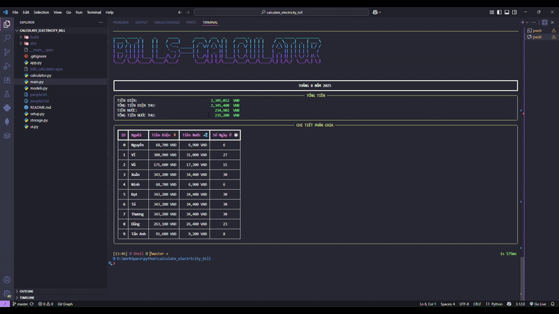

# Electricity Bill Calculator

A Python-based application to calculate electricity and water bills for shared accommodations. The app distributes costs based on individual stay durations.



## Features

- Calculate electricity and water bills proportionally based on stay days.
- Support for manual or file-based input of residents and their days off.
- Save and load resident data for reuse.
- Interactive command-line interface with rich text formatting.

## Installation

1. Clone the repository:
   ```bash
   git clone https://github.com/NguyenNguyen0/calculate_electricity_bill.git
   cd calculate_electricity_bill
   ```

2. Install dependencies:
   ```bash
   pip install -r requirements.txt
   ```

## Usage

### Method 1: Direct Python execution
```bash
python main.py
```

### Method 2: After installation
If you've installed the package (using `pip install .`), you can run:
```bash
bills-calculator
```

### Command-Line Options

- `--electric-bill` or `-e`: Specify the total electricity bill (VNĐ).
- `--water-bill` or `-w`: Specify the total water bill (VNĐ).
- `--people` or `-p`: Provide a list of residents in the format `name=stay_days` or just `name`.
- `--load-file` or `-lf`: Load resident data from a file.
- `--save-file` or `-sf`: Save resident data to a file.
- `--date-now` or `-dn`: Use the current date for calculations.
- `--month` or `-m`: Specify the billing month.
- `--year` or `-y`: Specify the billing year.

### Examples

**Interactive mode (no arguments):**
```bash
python main.py
```

**With command-line arguments:**
```bash
python main.py --electric-bill 500000 --water-bill 200000 --people "Alice=25" "Bob=28" --date-now
```

**Load people from file:**
```bash
python main.py --electric-bill 500000 --water-bill 200000 --load-file people.txt
```

**Save people to file (use Ctrl+C to trigger save):**
```bash
python main.py --electric-bill 500000 --water-bill 200000 --people "Alice=25" "Bob=28" --save-file people.txt
```

## File Structure

- `models.py`: Contains data models for residents and bills.
- `calculator.py`: Handles bill calculations.
- `storage.py`: Manages saving and loading resident data.
- `ui.py`: Provides a rich-text user interface.
- `app.py`: Main application logic.
- `__main__.py`: Entry point for the application.

## Requirements

- Python 3.10+
- Dependencies listed in `requirements.txt`

## License

This project is licensed under the MIT License. See the `LICENSE` file for details.
