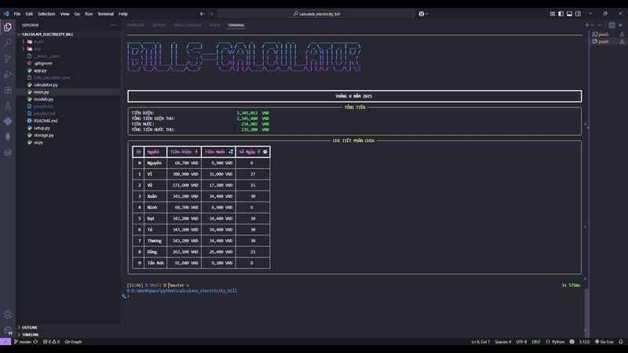

# ⚡ Electricity Bill Calculator 🪟💡

> A Python-based application to calculate electricity and water bills for shared accommodations. The app distributes costs based on individual stay durations using configurable calculation algorithms.



## ✨ Features

- 🧮 **Multiple Calculation Algorithms**: Choose between ratio-based or stair-step algorithms for fair cost distribution.
- 📊 **Ratio Algorithm** (default): Distributes costs proportionally based on each person's stay days.
- 📈 **Stair Algorithm**: Ensures everyone pays a base amount for minimum stay days, then distributes remaining costs based on extra days.
- 📝 Support for manual or file-based input of residents and their stay days.
- 💾 Save and load resident data for reuse.
- 🎨 Interactive command-line interface with rich text formatting and algorithm selection.
- ⚡ Real-time algorithm information and calculation status.
- 📦 Export kết quả ra TXT/CSV.
- 🕘 Lưu lịch sử tính tiền vào `data/history.json`.
- 📋 Copy kết quả dạng plain text vào clipboard.

## 🚀 Installation

1. 📥 Cài `uv` nếu chưa có:
   ```bash
   pip install uv
   ```

2. 📥 Clone the repository:
   ```bash
   git clone https://github.com/NguyenNguyen0/calculate_electricity_bill.git
   cd calculate_electricity_bill
   ```

3. 📦 Đồng bộ dependencies:
   ```bash
   uv sync
   ```

## 💻 Usage

### Method 1: 🐍 Direct Python execution
```bash
python -m bills_calculator
```

### Method 2: 📦 After installation
If you've installed the package into your environment, you can run:
```bash
bills-calculator
```

### ⚙️ Command-Line Options

- 🔌 `--electric-bill` or `-e`: Specify the total electricity bill (VNĐ).
- 💧 `--water-bill` or `-w`: Specify the total water bill (VNĐ).
- 👥 `--people` or `-p`: Provide a list of residents in the format `name=stay_days` or just `name`.
- 🧮 `--algorithm` or `-a`: Choose calculation algorithm: `ratio` (default), `stair`, or `equal`.
- 📂 `--load-file` or `-lf`: Load resident data from a file.
- 💾 `--save-file` or `-sf`: Save resident data to a file.
- 📤 `--export` or `-x`: Export kết quả ra `txt` hoặc `csv`.
- 🕘 `history`: Xem lịch sử tính tiền đã lưu.
- 🚫 `--no-history`: Tắt lưu lịch sử tự động.
- 📅 `--month` or `-m`: Specify the billing month.
- 🗓️ `--year` or `-y`: Specify the billing year.

## 🧮 Calculation Algorithms

### 📊 Ratio Algorithm (Default)
Distributes bills proportionally based on stay days:
- Each person pays: `(their_stay_days / total_stay_days) * total_bill`
- Simple and straightforward proportional distribution

### 📈 Stair Algorithm
Ensures fairness with a base rate for everyone:
- Everyone pays the same base amount for minimum stay days
- Remaining bill is distributed among those who stayed extra days
- More equitable for people with similar stay durations

### ⚖️ Equal Algorithm
Splits each bill evenly across all residents:
- Everyone pays the same share of electricity
- Everyone pays the same share of water
- Ignores stay duration completely

## 🔧 Examples

**🎯 Interactive mode (no arguments):**
```bash
python -m bills_calculator
```

**⚡ With command-line arguments using ratio algorithm (default):**
```bash
python -m bills_calculator --electric-bill 500000 --water-bill 200000 --people "Alice=25" -p "Bob=28"
```

**📈 Using stair algorithm for more equitable distribution:**
```bash
python -m bills_calculator --electric-bill 500000 --water-bill 200000 --people "Alice=25" -p "Bob=28" --algorithm stair
```

**📂 Load people from file with specific algorithm:**
```bash
python -m bills_calculator --electric-bill 500000 --water-bill 200000 --load-file people.txt --algorithm ratio
```

**💾 Save people to file:**
```bash
python -m bills_calculator --electric-bill 500000 --water-bill 200000 --people "Alice=25" -p "Bob=28" --save-file people.txt
```

**🔍 Compare algorithms with same data:**
```bash
# Ratio algorithm
python -m bills_calculator -e 1000000 -w 500000 -p "Alice=25" -p "Bob=30" -a ratio

# Stair algorithm  
python -m bills_calculator -e 1000000 -w 500000 -p "Alice=25" -p "Bob=30" -a stair
```

**📤 Export kết quả:**
```bash
python -m bills_calculator -e 1000000 -w 500000 -p "Alice=25" -p "Bob=30" --export txt
python -m bills_calculator -e 1000000 -w 500000 -p "Alice=25" -p "Bob=30" --export csv
```

**🕘 Xem lịch sử:**
```bash
python -m bills_calculator history
python -m bills_calculator history --year 2026 --month 4
```

## 📁 File Structure

- 📊 `models.py`: Contains data models for residents and bills.
- 🧮 `calculator.py`: Handles bill calculations.
- 💾 `storage.py`: Manages saving and loading resident data.
- 🎨 `ui.py`: Provides a rich-text user interface.
- 🏠 `app.py`: Main application logic.
- 🚀 `__main__.py`: Entry point for the application.

## 📋 Requirements

- 🐍 Python 3.10+
- 📦 Dependencies listed in `pyproject.toml` and locked by `uv.lock`

## 📄 License

This project is licensed under the MIT License. See the `LICENSE` file for details.
